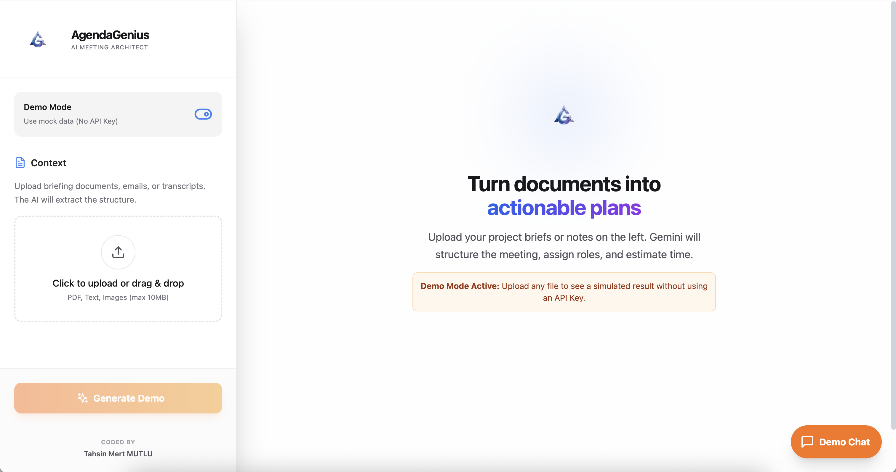

# AgendaGenius 🧠✨

**AgendaGenius**, dokümanlarınızı saniyeler içinde eyleme geçirilebilir toplantı planlarına, zaman çizelgelerine ve paydaş analizlerine dönüştüren, Google Gemini 3.0 Pro destekli akıllı bir toplantı mimarıdır.


## 🌟 Özellikler

*   **📄 Akıllı Doküman Analizi**: PDF, TXT, DOCX veya görselleri yükleyin; yapay zeka içeriği analiz edip yapılandırsın.
*   **⏱️ Otomatik Zaman Çizelgesi**: Toplantı konuları için tahmini süreleri ve sunucuları içeren görsel bir zaman çizelgesi oluşturur.
*   **👥 Paydaş Yönetimi**: Katılımcıları ve rollerini otomatik olarak çıkarır, manuel olarak düzenlemenize izin verir.
*   **✏️ Canlı Düzenleme**: Yapay zeka çıktılarını (süre, başlık, açıklama) tamamen düzenleyebilirsiniz.
*   **💬 Bağlam Duyarlı Chatbot**: Yüklenen dosyalar ve oluşturulan (veya düzenlenen) ajanda hakkında sorular sorun.
*   **🎨 Modern Arayüz**: Glassmorphism tasarımı, sürükle-bırak dosya yükleme ve akıcı animasyonlar.

## 🖼️ Ekran Görüntüleri





## 🚀 Kurulum ve Çalıştırma

Projeyi yerel ortamınızda çalıştırmak için aşağıdaki adımları izleyin:

### Gereksinimler
*   Node.js (v18 veya üzeri)
*   Google Gemini API Anahtarı

### Adımlar

1.  **Repoyu Klonlayın**
    ```bash
    git clone https://github.com/KULLANICI_ADINIZ/agenda-genius.git
    cd agenda-genius
    ```

2.  **Bağımlılıkları Yükleyin**
    ```bash
    npm install
    ```

3.  **API Anahtarını Ayarlayın**
    Kök dizinde `.env` dosyası oluşturun ve anahtarınızı ekleyin:
    ```env
    API_KEY=AIzaSy...
    ```
    *(Not: Bu projeyi bir build aracıyla kullanıyorsanız `VITE_API_KEY` veya backend proxy kullanmanız önerilir. Mevcut kod `process.env.API_KEY` yapısını kullanır.)*

4.  **Uygulamayı Başlatın**
    ```bash
    npm run dev
    ```

## 🛠️ Teknolojiler

*   **Frontend**: React 19, TypeScript
*   **Styling**: Tailwind CSS
*   **AI Model**: Google Gemini 3.0 Pro Preview (`@google/genai`)
*   **Icons**: Lucide React
*   **Build Tool**: Vite

## 👨‍💻 Geliştirici

Bu proje **Tahsin Mert MUTLU** tarafından kodlanmıştır.

---
*Not: Bu proje Google AI Studio yarışması veya kişisel portfolyo için geliştirilmiştir.*

---

## 📘 English README

# AgendaGenius 🧠✨

**AgendaGenius** is an AI-powered meeting architect, built on Google Gemini 3.0 Pro, that transforms your documents into actionable meeting agendas, visual timelines, and stakeholder analyses in seconds.


## 🌟 Features

- **📄 Smart Document Analysis**: Upload PDF, TXT, DOCX or image files; the AI analyzes and structures the content.
- **⏱️ Automatic Timeline Generation**: Creates a visual timeline of meeting topics with estimated durations and owners.
- **👥 Stakeholder Management**: Automatically extracts participants and their roles, and lets you edit them manually.
- **✏️ Live Editing**: Fully edit AI outputs (duration, title, description) before finalizing your agenda.
- **💬 Context-Aware Chatbot**: Ask questions about the uploaded files and the generated (or edited) agenda.
- **🎨 Modern UI**: Glassmorphism styling, drag-and-drop file upload, and smooth animations.

## 🚀 Getting Started

Follow these steps to run the project locally:

### Prerequisites

- Node.js (v18 or later)
- Google Gemini API Key

### Steps

1. **Clone the repository**

   ```bash
   git clone https://github.com/YOUR_USERNAME/agenda-genius.git
   cd agenda-genius
   ```

2. **Install dependencies**

   ```bash
   npm install
   ```

3. **Set up the API key**

   Create a `.env` file in the project root and add your key:

   ```env
   API_KEY=AIzaSy...
   ```

   *Note: If you are using a build tool, it is recommended to use `VITE_API_KEY` or a backend proxy. The current code uses `process.env.API_KEY`.*

4. **Run the app**

   ```bash
   npm run dev
   ```

## 🛠️ Tech Stack

- **Frontend**: React 19, TypeScript
- **Styling**: Tailwind CSS
- **AI Model**: Google Gemini 3.0 Pro Preview (`@google/genai`)
- **Icons**: Lucide React
- **Build Tool**: Vite

## 👨‍💻 Author

This project is developed by **Tahsin Mert MUTLU**.

---

*Note: This project was created for the Google AI Studio competition and/or as part of a personal portfolio.*
